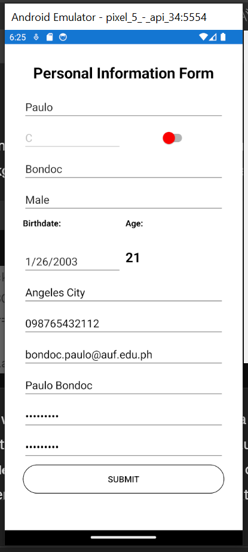

# Module05Forms

## PersonalInfoPage
[PersonalInfoPage.xaml](Module-05---Exercise-01/PersonalInfoPage.xaml)
[PersonalInfoPage.xaml.cs](Module-05---Exercise-01/PersonalInfoPage.xaml.cs)

## Filled and Unfilled

## Enabled and Disabled

## Telephone

## Email

## Masked Password

